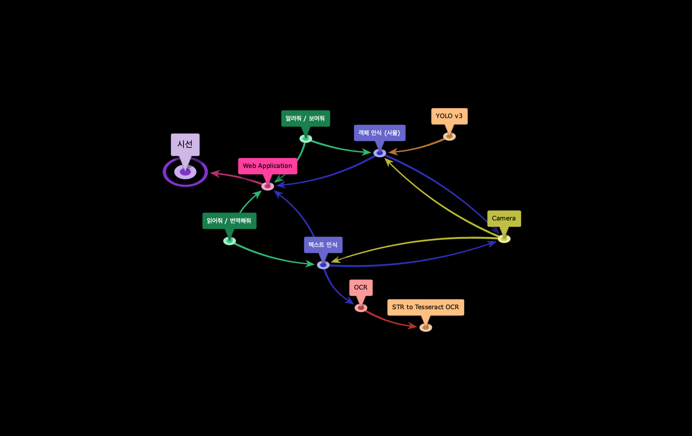
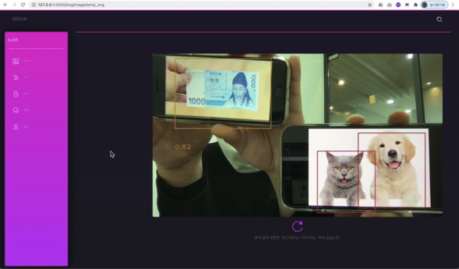
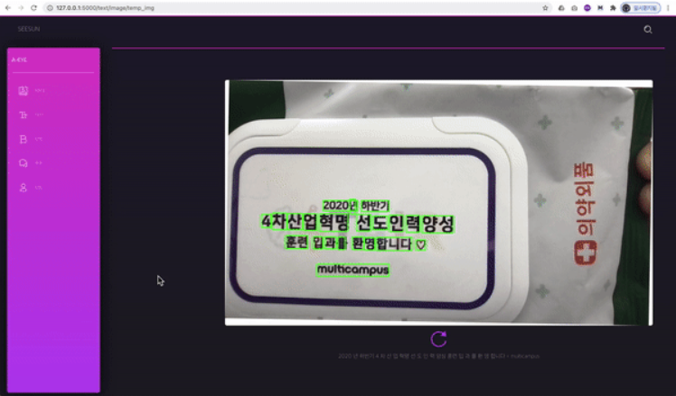

#  Seesun (시선)

멀티캠퍼스 딥러닝 기반 AI 엔지니어링 과정에서 파이널 프로젝트로 진행한 복합 AI 서비스 시선입니다. (우수상 :star: ​) 

Integrative-AI service project from _Deep Learning based AI engineering course_ at Multicampus (won 2nd place :star: ) 

​	


### Table of contents 

1. :scroll: [Overview](#idx1)
2. :game_die: [Role](#idx2)
3. :mag_right: [Skills & Process](#idx3)
4. :open_file_folder: [Service Architecture](#idx4)
5. :outbox_tray: [Main Function](#idx5)
6. :round_pushpin: [Result Report Summary](#idx6)

---

​	

## 1. Overview <a id="idx1"></a>

시선 서비스는 전맹, 약맥 및 시각적으로 불편하신 분들의 새로운 눈이 되어 세상을 밝혀주고자 진행하게 된 복합 AI 서비스입니다.

현재 음성을 통한 "보여줘" , "읽어줘" 와 같은 기능을 지원하며 웹 어플리케이션 형태로 구현하였습니다.

<p align="center">


</p>


	## [시연 영상(simulation video)](https://drive.google.com/file/d/18GEFLZXRDWiA-2HufVHxsTNec0NyiyJc/view?usp=sharing) <a></a> 

---

​	

## 2. Role <a id="idx2"></a>

 [jw0831](https://github.com/jw0831) 

- Prior research review (OCR, STR, CRAFT)
- Text detection modeling ( pytesseract)
- Text recognition modeling ( pytesseract)
- Text-image preprocessing (OpenCV , deskew)
- Support modularization
- Translator modeling (Seq2Seq , in progress)

 [ineed-coffee](https://github.com/ineed-coffee)

- Image data collection (AI HUB , Roboflow.ai , Google open image dataset)
- Define custom category & Image annotation work 
- Custom object detection modeling (YOLOv3 , darknet)
- Modularization & Maintenance
- Speech-to-text module work (Kakao open API)
- Support web application implementation (Flask)

 [heewonp](https://github.com/heewonp) 

- Prior research review (CRAFT, YOLOv5 from PyTorch)
- Image data collection (AI HUB , Roboflow.ai , Google open image dataset)
- Define custom category & Image annotation work 
- Custom object detection modeling (YOLOv3 , darknet)
- Video-stream module work (Flask)
- Web application implementation (Flask)

 [cjlee0217](https://github.com/cjlee0217)

- Prior research review (OCR, STR, EAST, CRAFT)
- Text detection modeling ( pytesseract)
- Text recognition modeling ( pytesseract)
- Text-image preprocessing (OpenCV , deskew)
- Translator modeling (Seq2Seq , in progress)

 [chloecmin](https://github.com/chloecmin)

- Text detection modeling ( pytesseract)
- Text recognition modeling ( pytesseract)
- Text-to-speech module work (Clova open API)
- Video-stream module work (Flask)
- Module QA

 	

---

​	

## 3. Skills & Process <a id="idx3"></a>

### Project skills 

__1. Language & Tool__ 

- Python 3.8 
- Visual Studio Code
- PyCharm


__2. Object detection model__ 

- Darknet framework :link: [Link](https://github.com/AlexeyAB/darknet)
- Fine tuning from YoloV3 pretrained weights
- opencv-dnn framework (4.4.0)

__3. Text recognition model__ 

- pytesseract (0.3.6)
- deskew (0.10.3)
- opencv-python (4.4.0)

### Development process 

2020.11.24 ~ 2020.12.23 

[WBS in details](https://drive.google.com/file/d/1L0GKjlu0fwBe_UINzBbXqwEl1mUZBACm/view?usp=sharing) 

​	

---

​	

## 4. Service Architecture <a id="idx4"></a>

<p align="center">
	
	 
</p>


​	

---

​	

## 5. Main Function <a id="idx5"></a>

### __【Show】 what's in front of you__ 

- by asking with specific keyword "보여줘" , our custom YOLO model will tell you what's in front of you

​	

__Recognizable object table__ 

|    __    |     __     |          __           |         __          |      __      |
| :------: | :--------: | :-------------------: | :-----------------: | :----------: |
| 1000 won | 10000 won  |         desk          |        chair        |   sunglass   |
|  bottle  |  umbrella  |          toy          |      chopstick      |    biker     |
|   car    | motorcycle |          cat          |         dog         |    person    |
|  truck   |    bus     | traffic light (green) | traffic light (red) | traffic sign |

 	

__Example__ 

```python
Out : "There are 1 1000won , 1 cat , and 1 dog in front of you"
```

 


### __【Read】 what's in front of you__ 

- by asking with specific keyword "읽어줘" , our pytesseract model will read the recognized text in front of you


__Example__ 

```python
Out : "2020년 하반기 4차산업혁명 선도인력 양성 훈련 입과를 환영합니다 multicampus"
```

 

​	

---

​	

## 6. Result Report Summary <a id="idx6"></a>

## 프로젝트 주제 선정 배경 및 구상


​	

---


